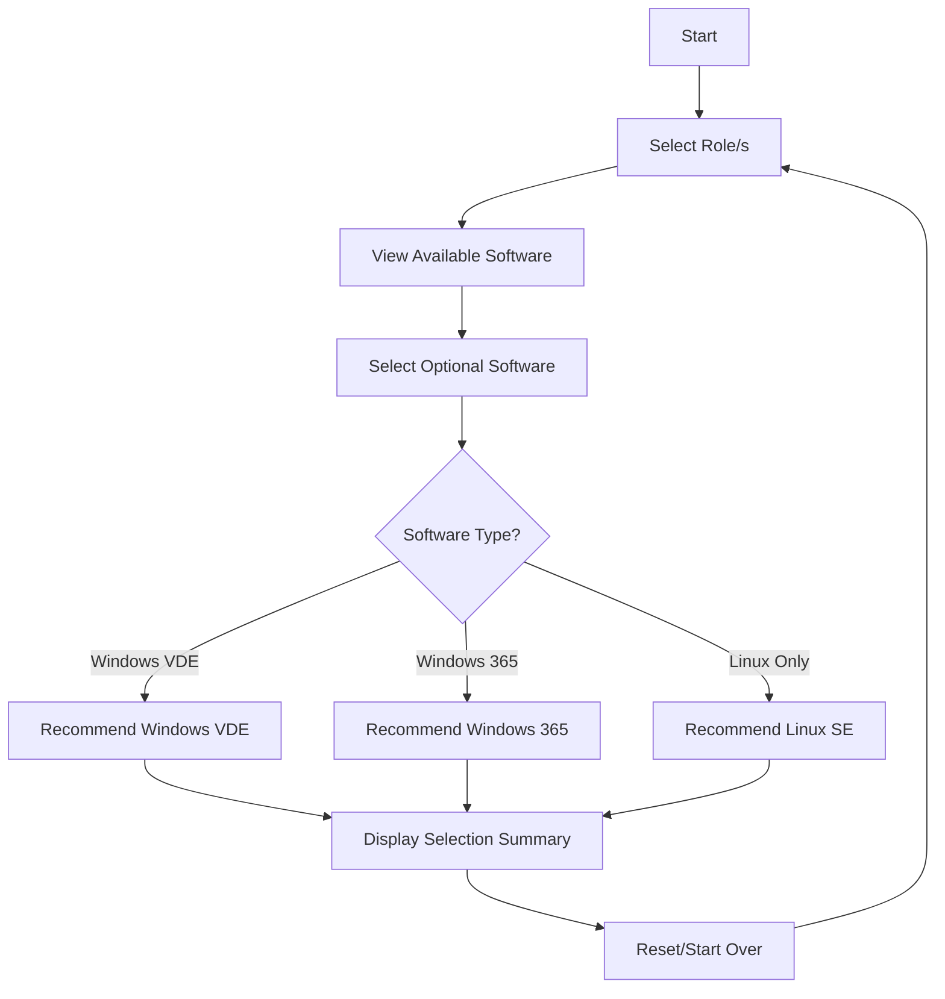

# DaaS Chooser

A React-based application to help users select the most appropriate Desktop-as-a-Service (DaaS) environment based on their roles and software requirements.

## Process Flow



## Local Development

### Prerequisites
- Node.js (v18 or higher)
- npm (v9 or higher)

### Setup and Running Locally
1. Clone the repository:
   ```bash
   git clone <repository-url>
   cd daaschooser-react
   ```

2. Install dependencies:
   ```bash
   npm install
   ```

3. Start the development server:
   ```bash
   npm run dev
   ```

4. Open your browser and navigate to `http://localhost:5173`

### Running Tests
The application uses Vitest for testing:

```bash
# Run tests
npm test

# Run tests with coverage
npm run test:coverage
```

## Building for Production

1. Build the application:
   ```bash
   npm run build
   ```

2. Preview the production build locally:
   ```bash
   npm run preview
   ```

## Docker Deployment

1. Build the Docker image:
   ```bash
   docker build -t daaschooser:latest .
   ```

2. Run the container locally:
   ```bash
   docker run -p 4173:4173 daaschooser:latest
   ```

## Kubernetes Deployment

### Prerequisites
- kubectl configured with your cluster
- A container registry accessible to your cluster

### Deployment Steps

1. Push the Docker image to your container registry:
   ```bash
   docker tag daaschooser:latest <your-registry>/daaschooser:latest
   docker push <your-registry>/daaschooser:latest
   ```

2. Update the image path in `k8s/deployment.yaml`:
   ```yaml
   image: <your-registry>/daaschooser:latest
   ```

3. Apply the Kubernetes manifests:
   ```bash
   kubectl apply -f k8s/deployment.yaml
   ```

4. Verify the deployment:
   ```bash
   kubectl get pods -l app=daaschooser
   kubectl get service daaschooser
   ```

## Architecture

The application is built using:
- React 18 with TypeScript
- Material-UI for components
- Vite for building and development
- Vitest for testing
- Docker for containerization
- Nginx for production serving

### Key Features
- Multi-role selection
- Dynamic software recommendations
- Automatic DaaS environment selection based on software requirements
- Responsive design
- Containerized deployment

## Development Notes

### State Management
The application uses React's built-in state management with:
- `useState` for simple state
- `useReducer` for complex state (software selections)
- `useCallback` and `useMemo` for performance optimization

### Testing
Tests are written using:
- Vitest as the test runner
- React Testing Library for component testing
- Coverage reports available via `npm run test:coverage`

### Performance Considerations
- Memoized callbacks and computations
- Efficient state updates using Set data structure
- Optimized rendering with conditional component mounting

## Contributing

1. Fork the repository
2. Create a feature branch
3. Make your changes
4. Run tests
5. Submit a pull request

## License

[Add your license information here]
